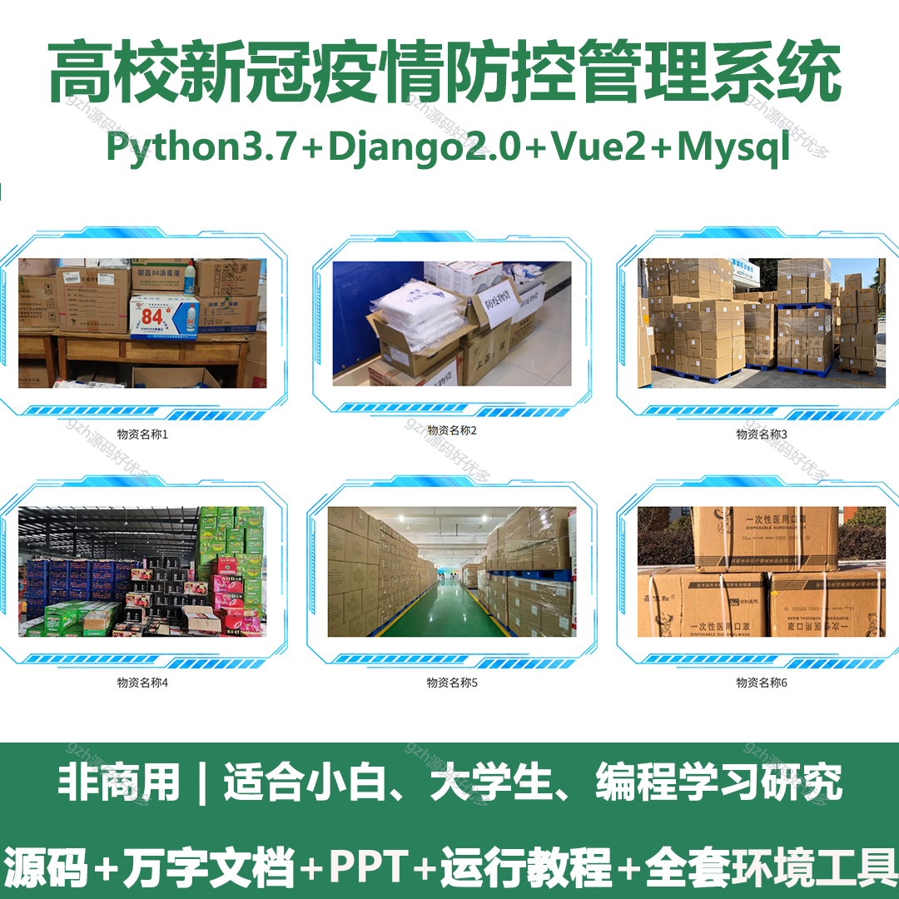
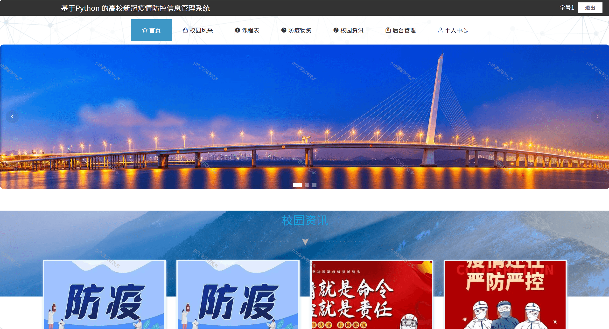
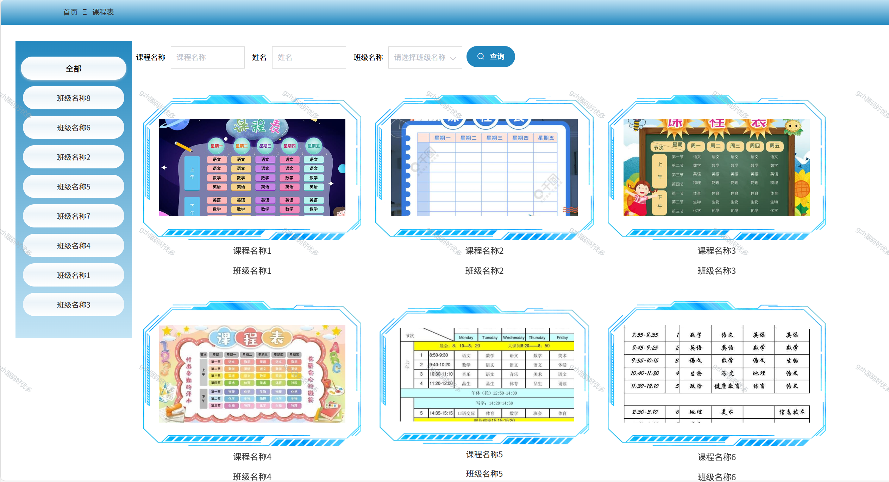
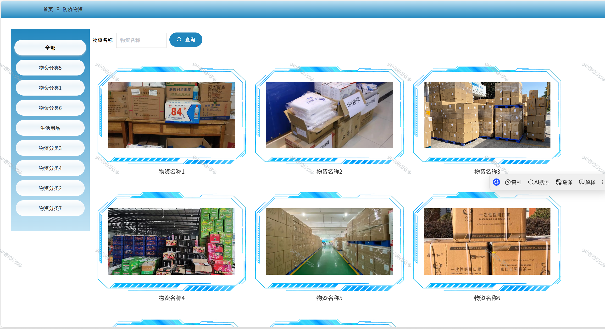
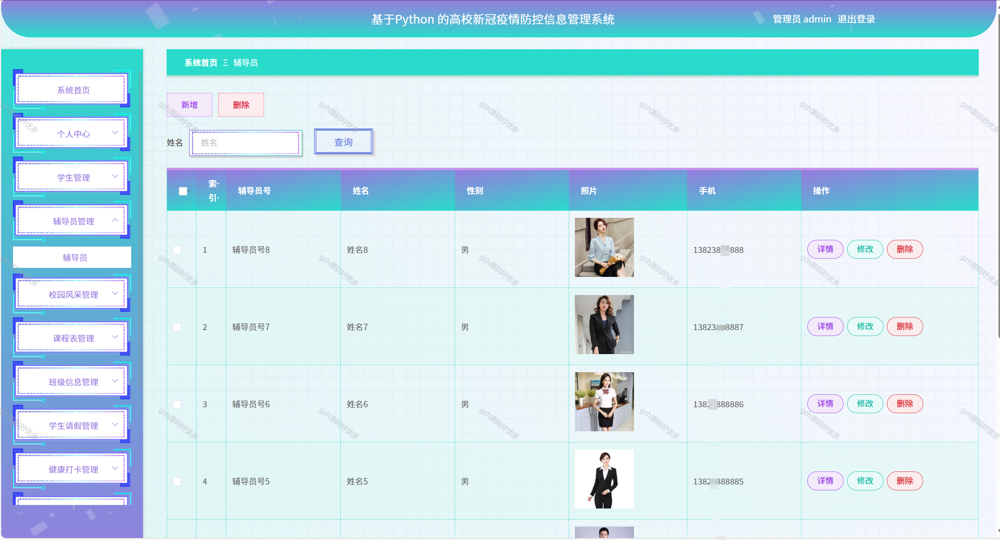
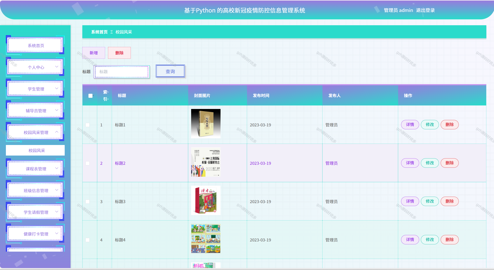
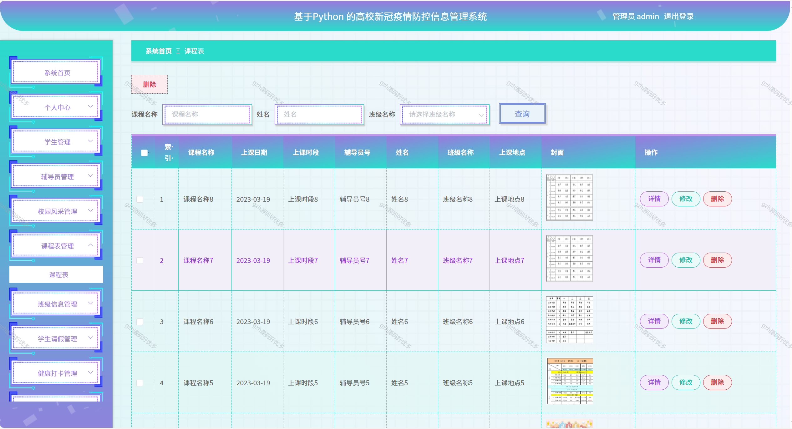
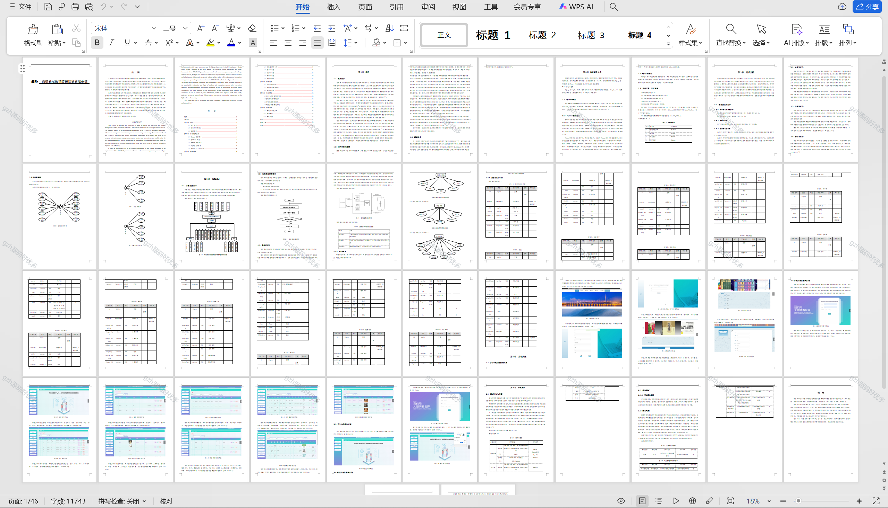

# python068
python068基于Python+Django的高校新冠疫情防控管理系统+LW+PPT
 
## 查看主页获取源码

### 一、关键词
高校新冠防疫管理系统，院校新冠疫情防控管理平台，新冠疫情防控管理系统

### 二、作品包含
源码+数据库+万字设计文档+PPT+全套环境和工具资源+本地部署教程

### 三、项目技术
前端技术：Vue2.0、Element-ui
后端技术：Python3.7、Django2.0

### 四、运行环境（以下版本亲测，其他版本兼容性请自行测试）
开发工具：PyCharm + VSCODE

数据库：MySQL5.7（最低要5.7版本）

数据库管理工具：Navicat10+

Python：Python3.7

前端Nodejs：14

浏览器：谷歌浏览器

### 五、项目介绍
项目编号：python068

高校新冠疫情防控信息管理自动化系统的开发和研制的最终目的是将高校新冠疫情防控信息管理的运作模式从手工记录数据转变为网络信息查询管理，从而为现代管理人员的使用提供更多的便利和条件。使高校新冠疫情防控信息管理系统数字化、智能化，是提高工作效率的重要举措。
系统以学生、辅导员和管理员三类人，作为目标用户，其中用户主要功能包含学生、辅导员的注册与登录，校园风采、课程表、防疫物资、校园资讯等，对账号相关信息的修改；管理员主要功能包括了对学生、辅导员的信息以及课程表、班级信息、学生请假、健康打卡、防疫物资等；管理员可以实现最高权限级别的全系统管理，

### 六、运行截图

